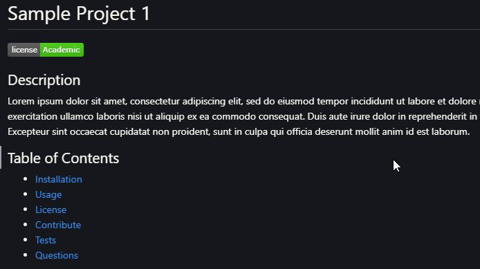

# README Generator

## Overview: 

I built a readme generator using node.js and inquirer that can be run through the terminal. The user is prompted to answer a series of questions that help fill in the readme file. 

## Technologies used: 
  * JavaScript
  * Node.js
  * Inquirer

